# 取引先申請情報確認システム シーケンス図

## システム概要
申請された取引先情報（会社名・住所・電話番号等）の真正性・実在性をWebサイト解析により自動で確認し、架空請求やペーパーカンパニーのリスクを低減するシステムのシーケンス図です。

## 1. メインシーケンス図（全体の流れ）
このシーケンス図は、システム全体の時系列での動作を表現しています：

**📋 読み方のポイント**
- **縦軸**: 時間の経過（上から下へ）
- **横軸**: 各コンポーネント（ユーザー、各モジュール、外部API）
- **矢印**: メソッド呼び出しやデータの流れ
- **Note**: 処理フェーズの区切りと説明

**🔄 主要な処理フェーズ**
1. **システム初期化**: 設定読み込み、ロガー設定、フラグ初期化
2. **API使用状況確認**: Google Search APIの制限チェック
3. **申請情報取得・整理**: テストモードまたはコマンドライン引数の処理
4. **AI検索クエリ生成**: Ollamaによる効果的な検索クエリの自動生成
5. **検索・解析ループ**: 各クエリでGoogle検索→スクレイピング→AI解析を実行
6. **結果統合・出力**: 最終的な判定結果をJSON/Markdownで出力

**⚡ 早期終了制御**
- スコア95%以上を検出した時点で残り処理をスキップ
- 効率的にリソースを使用して高精度な結果を素早く取得

**🛡️ エラーハンドリング戦略**
- **API制限超過**: 一時的に処理を停止し、翌日まで待機
- **Webサイトアクセス拒否**: robots.txtに従い、該当URLをスキップ
- **AI解析失敗**: ログ記録後、次の候補URLで処理継続
- **ネットワークエラー**: 3回まで自動リトライ

**📊 品質保証の仕組み**
- **多角的検証**: 複数の検索クエリで同一企業を調査
- **段階的精査**: メインページ→関連ページ→会社情報ページの順で詳細化
- **AI判定の透明性**: 各スコアの根拠となる情報を詳細ログに記録

```mermaid
sequenceDiagram
    participant User as 👤 ユーザー
    participant Main as 🏠 main.py
    participant Config as ⚙️ config.py
    participant Utils as 🛠️ utils.py
    participant Analyzer as 🤖 analyzer.py
    participant Search as 🔍 search.py
    participant Scraper as 🕷️ scraper.py
    participant Ollama as 🧠 Ollama API
    participant Google as 🌐 Google Search API
    participant WebSite as 📄 対象Webサイト
    
    User->>Main: 🚀 python main.py または TestCompanyInfo
    
    Note over Main: 📋 1. システム初期化フェーズ
    Main->>Main: 🧹 load_dotenv() - 環境変数クリア
    Main->>Config: ⚙️ load_config() - 設定読み込み
    Config->>Config: 📊 os.getenv() × 設定項目
    Config-->>Main: 📦 config辞書
    Main->>Utils: 📝 setup_logger() - ロガー設定
    Utils-->>Main: ✅ logger設定完了
    Main->>Utils: 🔄 reset_early_termination() - フラグ初期化
    
    Note over Main: 📊 2. API使用状況確認フェーズ
    Main->>Utils: 📈 get_current_api_usage() - 本日使用量確認
    Utils-->>Main: 📊 current_usage
    Main->>Utils: ⚠️ check_api_usage_warning() - 警告レベル判定
    Utils-->>Main: 🚨 warning_level
    Main->>Utils: 🛡️ enhanced_check_api_limit() - 実行可否判定
    Utils-->>Main: ✅ can_execute, ⏱️ wait_time
    
    Note over Main: 📄 3. 申請情報取得・整理フェーズ
    alt 🧪 テストモード
        Main->>Main: 🏢 TestCompanyInfo使用
    else 💻 コマンドラインモード
        Main->>Main: 📝 parse_args() - 引数解析
    end
    Main->>Main: 📋 application_info = [company, address, tel, other]
    
    Note over Main: 🤖 4. AI検索クエリ生成フェーズ
    Main->>Analyzer: ai_generate_query(application_info, ollama_url, ollama_model, max_queries)
    Analyzer->>Analyzer: 申請情報解析・プロンプト作成
    Analyzer->>Ollama: POST /api/chat (検索クエリ生成要求)
    Ollama-->>Analyzer: 検索クエリリスト
    Analyzer->>Analyzer: クエリフィルタリング・重複除去
    Analyzer-->>Main: queries = [query1, query2, ...]
    
    Note over Main: 5. 各クエリでの検索・解析ループ
    loop 各検索クエリ
        Main->>Main: check_early_termination()
        alt 早期終了フラグ=True
            Main->>Main: ループ終了
        else 継続
            Main->>Search: google_search(query, api_key, cse_id, num, config)
            Search->>Utils: enhanced_check_api_limit()
            Search->>Utils: record_api_call()
            Search->>Google: GET Custom Search API
            Google-->>Search: 検索結果JSON
            Search->>Utils: update_api_usage()
            Search-->>Main: search_results = [{title, link}, ...]
            
            Note over Main: 6. 各URLでのスクレイピング・解析ループ
            loop 各検索結果URL
                Main->>Main: check_early_termination()
                alt 早期終了フラグ=True
                    Main->>Main: ループ終了
                else 継続
                    Note over Main: 6.1. メインページスクレイピング
                    Main->>Scraper: scrape_page(url, timeout, user_agent)
                    Scraper->>Scraper: check_robots_txt(url, user_agent)
                    Scraper->>WebSite: GET robots.txt
                    WebSite-->>Scraper: robots.txt または 404
                    alt robots.txt許可
                        Scraper->>WebSite: GET ページコンテンツ
                        WebSite-->>Scraper: HTMLコンテンツ
                        Scraper->>Scraper: BeautifulSoup解析(title, content, links)
                        Scraper-->>Main: scraped_result = {title, url, content, links}
                        
                        Note over Main: 6.2. メインページAI解析
                        Main->>Main: process_single_page()
                        Main->>Analyzer: ai_analyze_content(application_info, scraped_result, ollama_url, ollama_model)
                        Analyzer->>Analyzer: 申請情報抽出・プロンプト作成
                        Analyzer->>Ollama: POST /api/chat (一致度解析要求)
                        Ollama-->>Analyzer: JSON{score, reasoning, matched_info, confidence}
                        Analyzer->>Analyzer: スコア正規化(0.0-1.0)
                        Analyzer-->>Main: analysis_result
                        
                        alt スコア >= 閾値(0.95)
                            Main->>Utils: set_early_termination()
                            Main->>Main: 早期終了フラグ設定・処理終了
                        else 継続
                            Note over Main: 6.3. 関連ページスクレイピング
                            Main->>Scraper: scrape_recursive(url, depth=1, max_depth, visited, timeout, user_agent, scrape_interval)
                            loop 関連ページごと
                                Scraper->>Scraper: time.sleep(scrape_interval)
                                Scraper->>Scraper: scrape_page(related_url)
                                Scraper->>Scraper: check_robots_txt(related_url)
                                alt robots.txt許可
                                    Scraper->>WebSite: GET 関連ページコンテンツ
                                    WebSite-->>Scraper: HTMLコンテンツ
                                    Scraper->>Scraper: リンク抽出・同一ドメインフィルタ
                                else robots.txt禁止
                                    Scraper->>Scraper: スキップ
                                end
                            end
                            Scraper-->>Main: scraped_pages = [scraped_result, ...]
                            
                            Note over Main: 6.4. 関連ページAI解析
                            loop 各関連ページ
                                Main->>Main: check_early_termination()
                                alt 早期終了フラグ=True
                                    Main->>Main: ループ終了
                                else 継続
                                    Main->>Main: process_single_page()
                                    Main->>Analyzer: ai_analyze_content()
                                    Analyzer->>Ollama: POST /api/chat
                                    Ollama-->>Analyzer: JSON解析結果
                                    Analyzer-->>Main: analysis_result
                                    
                                    alt スコア >= 閾値(0.95)
                                        Main->>Utils: set_early_termination()
                                        Main->>Main: 早期終了フラグ設定・処理終了
                                    end
                                end
                            end
                        end
                    else robots.txt禁止
                        Scraper-->>Main: error: robots.txt disallowed
                    end
                end
            end
        end
    end
    
    Note over Main: 7. 結果統合・出力
    Main->>Main: 全結果統合・スコア順ソート
    Main->>Main: マッチング判定(best_score >= threshold)
    Main->>Utils: standardize_output_format(raw_result)
    Utils-->>Main: standardized_result
    Main->>Utils: write_result_json(standardized_result)
    Main->>Utils: write_result_markdown(standardized_result)
    Utils->>Utils: ファイル出力(result.json, result.md)
    Main-->>User: 処理完了・判定結果
```

## 2. 初期化・設定シーケンス図
- 初期化・設定: 環境変数読み込みからロガー設定まで

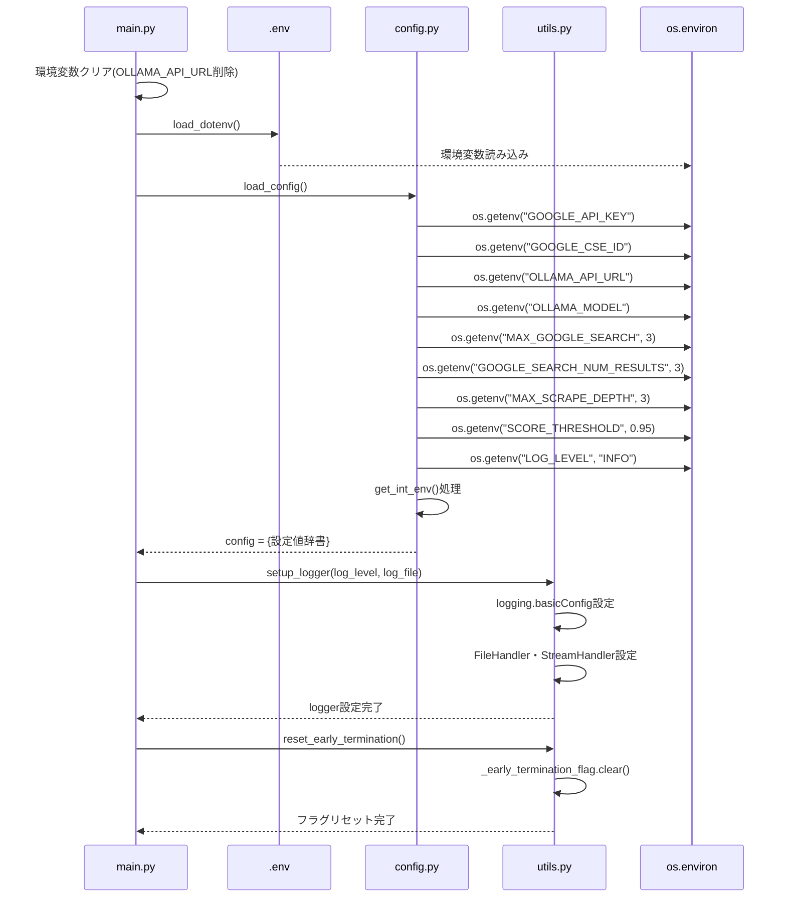

## 3. API制限管理シーケンス図
- API制限管理: Google Search APIの使用量管理と制限チェック

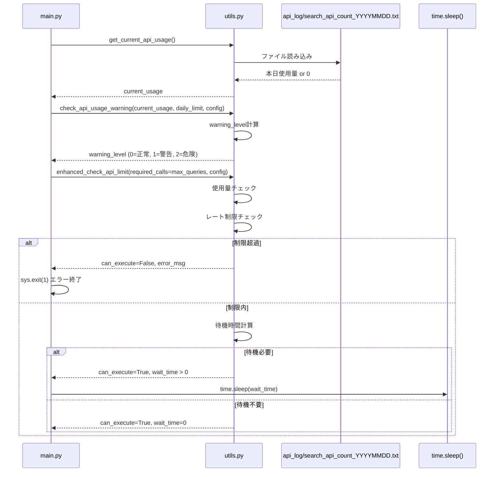

## 4. Google検索シーケンス図
- Google検索: Custom Search API呼び出しの詳細手順

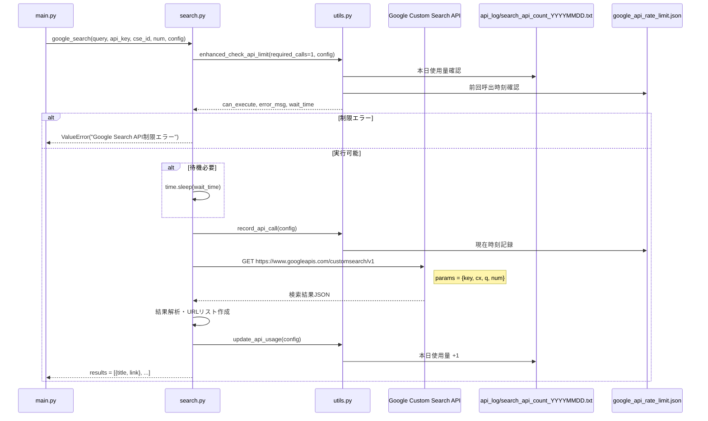

## 5. スクレイピング・robots.txt遵守シーケンス図
- スクレイピング・robots.txt遵守: 倫理的スクレイピングの実装

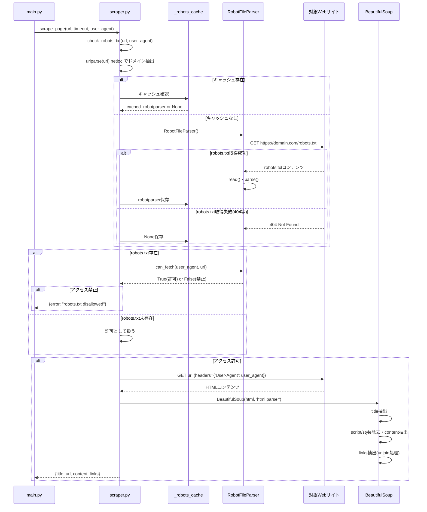

## 6. 再帰スクレイピングシーケンス図
- 再帰スクレイピング: 関連ページの自動探索処理

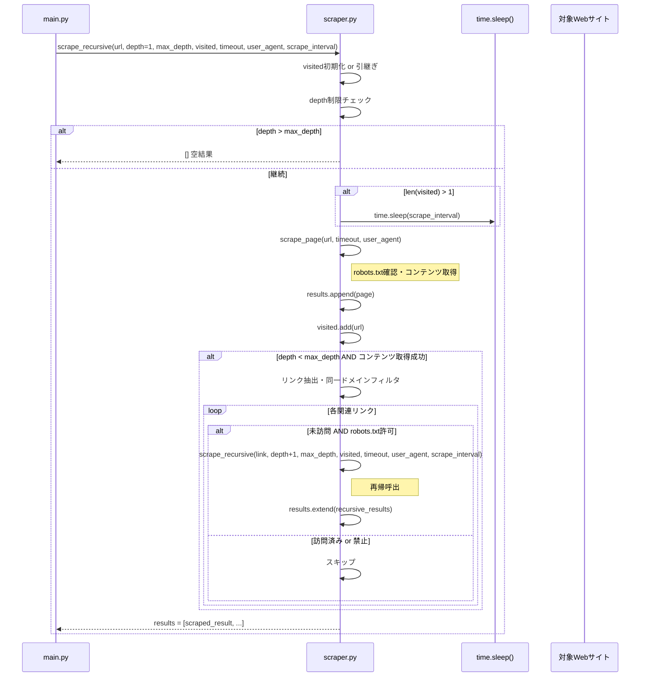

## 7. AI解析シーケンス図
- AI解析: Ollamaを使った申請情報との照合処理

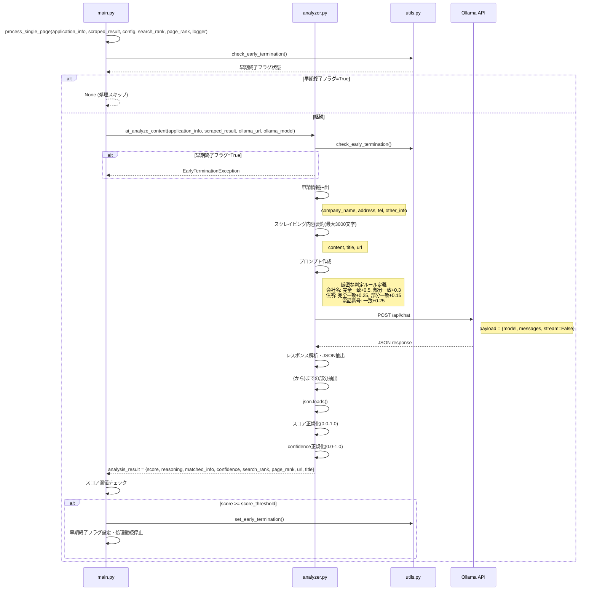

## 8. AI検索クエリ生成シーケンス図
- AI検索クエリ生成: 効果的な検索クエリの自動生成

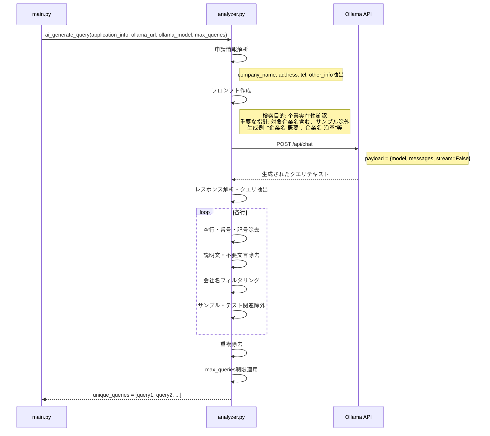

## 9. 早期終了制御シーケンス図
- 早期終了制御: 高スコア検出時の効率的な処理制御

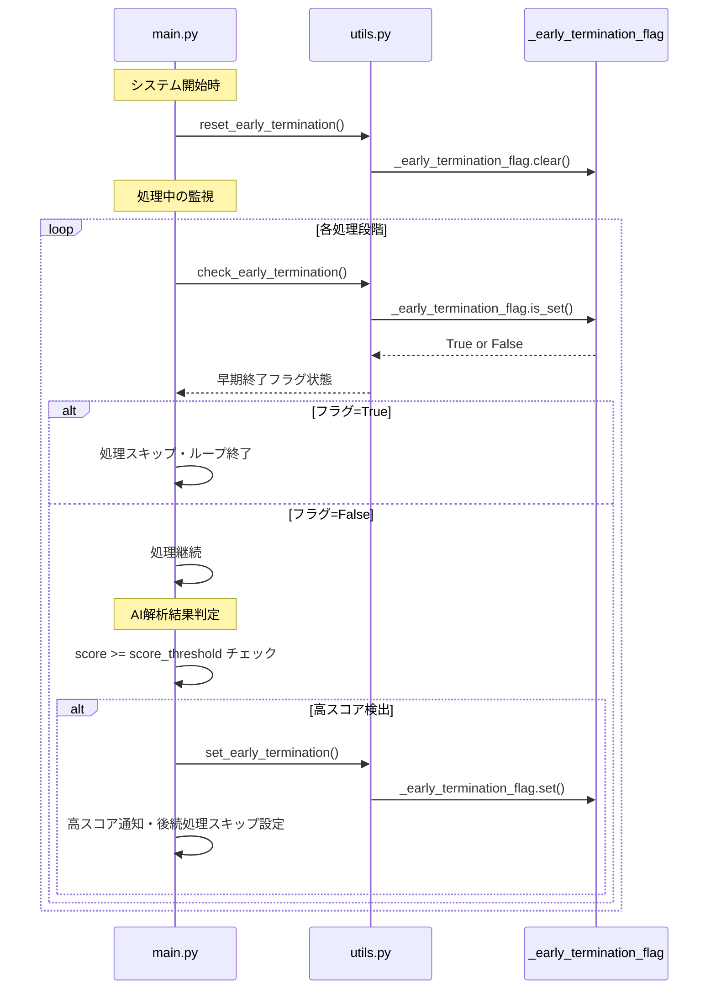

## 10. 結果出力シーケンス図
- 結果出力: JSON/Markdown形式での結果ファイル出力

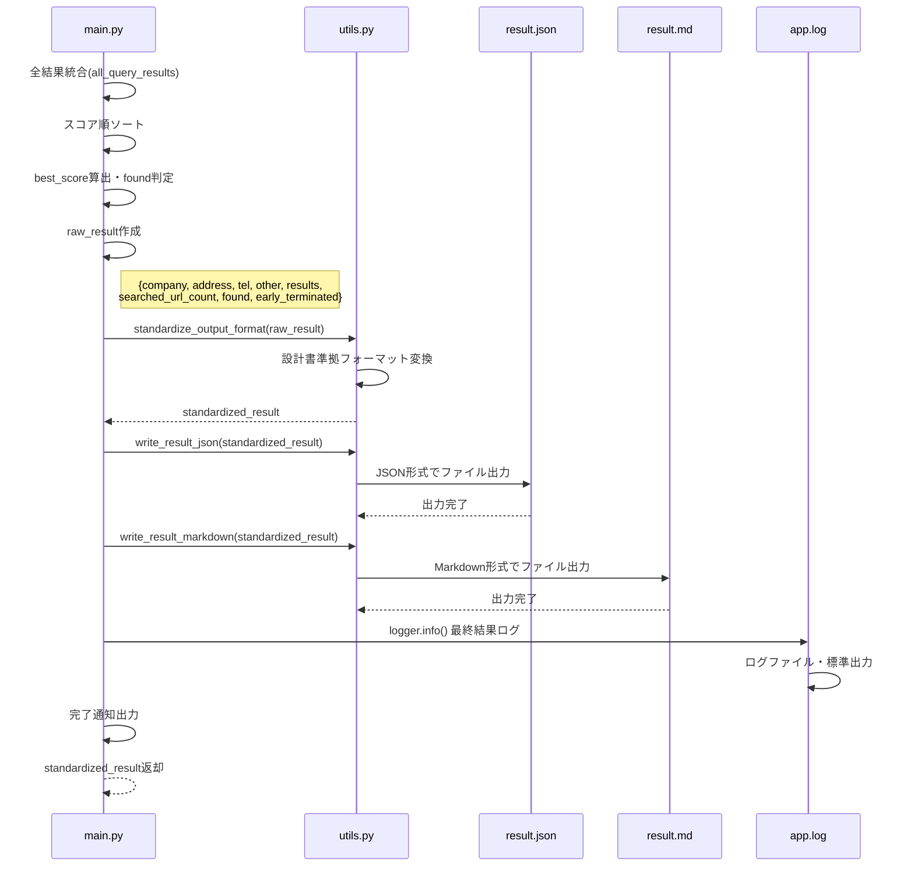

## 11. エラーハンドリングシーケンス図
- エラーハンドリング: 各種例外処理の詳細

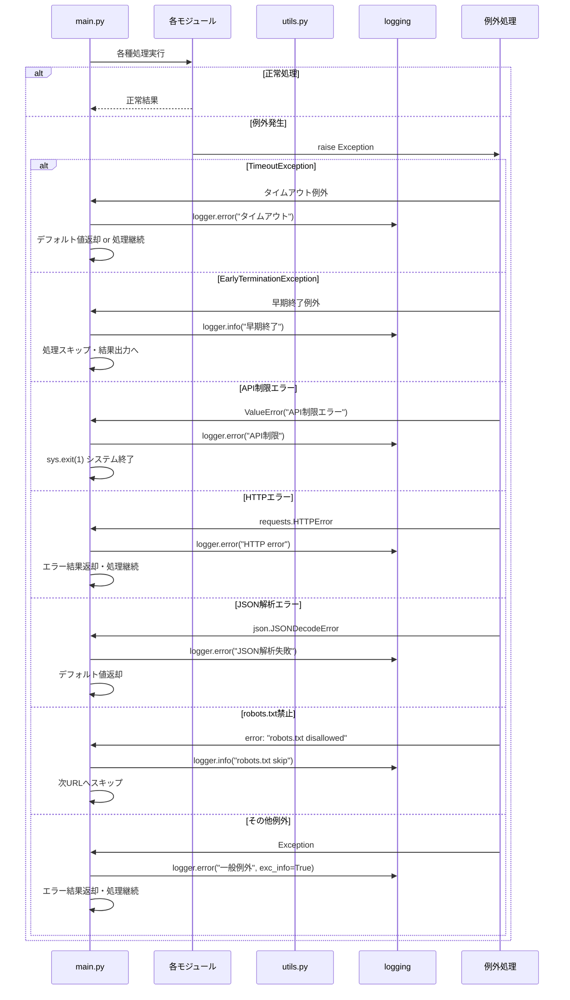

## 12. API レート制限・使用量管理シーケンス図
- API レート制限・使用量管理: 日次制限とレート制限の管理

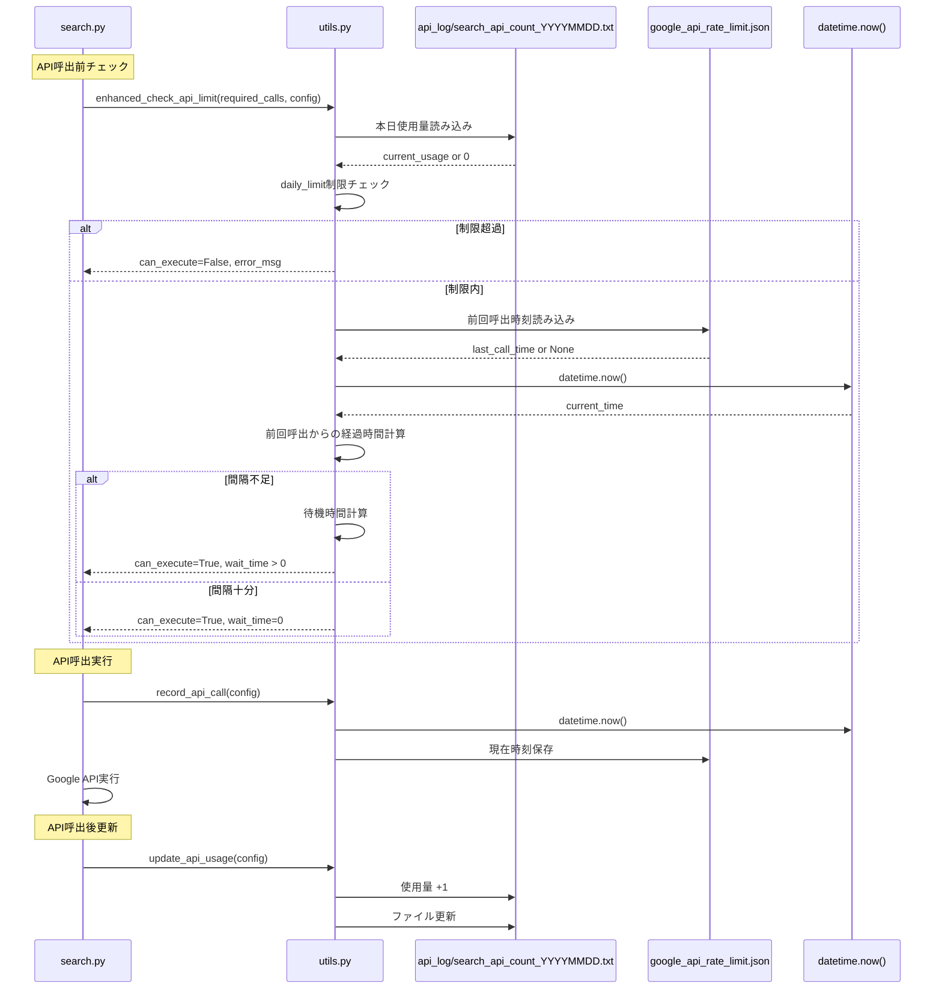

## 重要なシーケンス特徴

### 1. 早期終了制御
- 各処理段階で `check_early_termination()` を実行
- 高スコア検出時に `set_early_termination()` でフラグ設定
- 後続の全処理が自動的にスキップされ、効率的に処理終了

### 2. robots.txt遵守
- 全スクレイピング前に必ず `check_robots_txt()` を実行
- ドメインごとのキャッシュ機能で効率化
- 禁止されたURLは自動的にスキップ

### 3. API制限管理
- Google Search API使用前に制限チェック
- 日次使用量をファイルで永続化
- レート制限による自動待機機能

### 4. エラーハンドリング
- 各段階での例外処理
- ログ出力による詳細な実行記録
- エラー時のデフォルト値返却で処理継続

### 5. 並行処理制御
- 早期終了フラグによる全処理の協調制御
- スレッドセーフな状態管理
- 効率的なリソース使用

このシーケンス図により、システム全体の時系列での動作と各コンポーネント間の相互作用が詳細に把握できます。

## 📋 シーケンス図の技術的詳細解説

### 1. 参加者（Participants）の役割と責任

#### 👤 ユーザー（User）
- **役割**: システムの実行者
- **入力方法**: 
  - コマンドライン: `python main.py "会社名" "住所" "電話番号"`
  - テストモード: コード内の`TestCompanyInfo`を使用
- **期待する出力**: JSON形式とMarkdown形式の調査結果

#### 🏠 main.py（Main Controller）
- **役割**: システム全体のオーケストレーター
- **主な責任**:
  - 各モジュールの初期化と連携制御
  - 処理フローの管理と早期終了制御
  - エラーハンドリングと例外処理
  - 最終結果の統合と出力

#### ⚙️ config.py（Configuration Manager）
- **役割**: システム設定の管理
- **設定項目**:
  ```python
  GOOGLE_API_KEY = os.getenv('GOOGLE_API_KEY')
  GOOGLE_CSE_ID = os.getenv('GOOGLE_CSE_ID')
  OLLAMA_URL = os.getenv('OLLAMA_URL', 'http://localhost:11434')
  OLLAMA_MODEL = os.getenv('OLLAMA_MODEL', 'llama3.1')
  ```

#### 🛠️ utils.py（Utility Functions）
- **役割**: 共通機能とユーティリティの提供
- **主要機能**:
  - API使用量の追跡と制限管理
  - ロギング設定とログ出力
  - 早期終了制御のフラグ管理
  - レート制限の監視

#### 🤖 analyzer.py（AI Analysis Engine）
- **役割**: AI解析エンジン
- **処理内容**:
  - 検索クエリの自動生成
  - Webページコンテンツのスコア化
  - 申請情報との一致度分析
  - 信頼性評価

#### 🔍 search.py（Search Interface）
- **役割**: Google Search APIとの連携
- **API管理**:
  - 検索要求の実行
  - 結果の解析と標準化
  - エラーハンドリング
  - 使用量の記録

#### 🕷️ scraper.py（Web Scraper）
- **役割**: Webサイトコンテンツの抽出
- **技術仕様**:
  - robots.txt遵守チェック
  - HTMLパース処理
  - 関連ページの探索
  - レスポンシブルクローリング

### 2. 重要な処理フローの詳細

#### 🚀 システム初期化シーケンス
```
1. 環境変数のクリア → 前回実行の影響を排除
2. .envファイル読み込み → API認証情報の取得
3. config辞書の作成 → 実行時パラメータの設定
4. ロガー初期化 → 実行ログの設定
5. フラグリセット → 早期終了制御の準備
```

#### 🔍 検索・解析ループの詳細
```
For each query:
  1. 早期終了フラグチェック
  2. API制限確認
  3. Google検索実行
  4. 検索結果取得
  5. For each URL:
       a. robots.txtチェック
       b. ページスクレイピング
       c. AI解析実行
       d. スコア判定
       e. 早期終了判定
```

#### 🧠 AI解析プロセスの詳細
```
1. 申請情報の構造化
2. プロンプト生成
3. Ollama APIへのPOST要求
4. レスポンス解析
5. スコア算出
6. 信頼性レベル判定
```

### 3. エラーハンドリング戦略

#### 📡 API関連エラー
- **Google Search API**:
  - 制限超過: 翌日まで待機
  - 認証エラー: APIキー確認を促すメッセージ
  - ネットワークエラー: 3回まで自動リトライ

- **Ollama API**:
  - サーバー未起動: 起動手順を表示
  - モデル未対応: 利用可能モデル一覧を表示
  - タイムアウト: より小さなデータで再試行

#### 🌐 スクレイピング関連エラー
- **robots.txt拒否**: 該当URLをスキップし、次候補で継続
- **404エラー**: ログ記録後、処理継続
- **タイムアウト**: タイムアウト時間を延長して再試行
- **パース失敗**: 別のパーサーでリトライ

#### 🔧 システムレベルエラー
- **メモリ不足**: 処理データサイズを削減して再実行
- **ディスク容量不足**: 古いログファイルを自動削除
- **設定ファイルエラー**: デフォルト値で継続実行

### 4. パフォーマンス最適化のポイント

#### ⚡ 並行処理
- **URL並行スクレイピング**: 複数URLを同時処理（設定可能）
- **AI解析キュー**: バッチ処理でスループット向上
- **非同期I/O**: ネットワーク待機時間の最適化

#### 🗄️ キャッシュ戦略
- **検索結果キャッシュ**: 同一クエリの重複実行防止
- **ページコンテンツキャッシュ**: 関連ページ探索の効率化
- **AI解析結果キャッシュ**: 同一コンテンツの再解析防止

#### 📊 メモリ管理
- **大容量データの分割処理**: メモリ使用量の制御
- **不要オブジェクトの解放**: ガベージコレクション最適化
- **ストリーミング処理**: 大きなWebページの逐次処理

### 5. 運用監視ポイント

#### 📈 パフォーマンスメトリクス
- **API応答時間**: Google Search/Ollama APIの応答速度監視
- **スクレイピング成功率**: robots.txt遵守率とアクセス成功率
- **AI解析精度**: 人間による検証結果との比較
- **全体処理時間**: 1件あたりの平均処理時間

#### 🚨 アラート設定
- **API制限接近**: 使用量80%で管理者に通知
- **連続エラー発生**: 5回連続失敗で処理停止
- **異常なスコア分布**: 全て低スコアまたは全て高スコアの場合
- **処理時間超過**: 30分を超える処理の場合

### 6. セキュリティ考慮事項

#### 🔐 認証情報管理
- **APIキー暗号化**: 本番環境では暗号化保存
- **アクセス制限**: 実行権限の適切な管理
- **ログのサニタイズ**: 機密情報のログ出力防止

#### 🛡️ Webスクレイピングのモラル
- **robots.txt完全遵守**: 必須要件として実装
- **アクセス頻度制限**: サーバー負荷への配慮
- **User-Agent明示**: 適切な識別情報の送信
- **データ利用範囲の限定**: 調査目的のみに使用
