# 取引先申請情報確認システム フロー図

## システム概要
申請された取引先情報（会社名・住所・電話番号等）の真正性・実在性をWebサイト解析により自動で確認し、架空請求やペーパーカンパニーのリスクを低減するシステムです。

## メインフロー図
- main.pyを起点とした全体的な処理の流れ
- 早期終了制御の仕組み
- 各段階での条件分岐と判定処理

```mermaid
graph TD
    %% システム開始・初期化フェーズ
    A[main.py 開始] --> A1[環境変数クリア]
    A1 --> A2[load_dotenv & config読込]
    A2 --> A3[setup_logger設定]
    A3 --> A4[早期終了フラグリセット]
    A4 --> A5[設定値取得<br/>max_queries, num_results,<br/>max_scrape_depth, score_threshold]
    
    %% API制限チェックフェーズ
    A5 --> B[API使用状況確認]
    B --> B1{API制限チェック}
    B1 -->|制限超過| B2[エラー終了]
    B1 -->|OK| C[企業情報取得]
    
    %% 申請情報取得・整理フェーズ
    C --> C1{テストモード？}
    C1 -->|Yes| C2[TestCompanyInfo使用]
    C1 -->|No| C3[コマンドライン引数解析]
    C2 --> D[申請情報リスト作成]
    C3 --> D
    
    %% AI検索クエリ生成フェーズ
    D --> E[AI検索クエリ生成]
    E --> F[各クエリループ開始]
    
    %% メインループ: 各検索クエリの処理
    F --> F1{早期終了フラグ？}
    F1 -->|Yes| Y[結果統合・出力]
    F1 -->|No| G[Google検索実行]
    
    %% Google検索結果の処理
    G --> H[検索結果URLリスト取得]
    H --> I[各URLループ開始]
    
    %% 各URLのスクレイピング・解析ループ
    I --> I1{早期終了フラグ？}
    I1 -->|Yes| X[クエリループ終了]
    I1 -->|No| J[メインページスクレイピング]
    
    %% robots.txt遵守チェック
    J --> J1{robots.txt許可？}
    J1 -->|No| J2[スキップ・次URL]
    J1 -->|Yes| K[ページコンテンツ取得]
    
    %% スクレイピング成功チェック
    K --> K1{スクレイピング成功？}
    K1 -->|No| J2
    K1 -->|Yes| L[AI解析実行]
    
    %% AI解析・スコア判定（重要な分岐点）
    L --> M[スコア算出]
    M --> M1{スコア >= 閾値？}
    M1 -->|Yes| M2[早期終了フラグ設定]
    M2 --> M3[高スコア検出通知]
    M3 --> Y
    
    %% 関連ページスクレイピングフェーズ
    M1 -->|No| N{早期終了フラグ？}
    N -->|Yes| X
    N -->|No| O[関連ページスクレイピング]
    
    O --> P[再帰スクレイピング実行]
    P --> Q[関連ページループ]
    
    %% 関連ページの解析ループ
    Q --> Q1{早期終了フラグ？}
    Q1 -->|Yes| X
    Q1 -->|No| Q2{robots.txt許可？}
    Q2 -->|No| Q3[スキップ・次ページ]
    Q2 -->|Yes| R[関連ページAI解析]
    
    %% 関連ページでの高スコア検出
    R --> S[関連ページスコア算出]
    S --> S1{スコア >= 閾値？}
    S1 -->|Yes| S2[早期終了フラグ設定]
    S2 --> S3[高スコア検出通知]
    S3 --> Y
    S1 -->|No| Q3
    
    %% ループ制御・統計処理
    Q3 --> Q4{関連ページ終了？}
    Q4 -->|No| Q
    Q4 -->|Yes| T[現URLの解析結果統計表示]
    
    T --> U{URLループ終了？}
    U -->|No| I
    U -->|Yes| V[クエリ結果表示・蓄積]
    
    %% クエリループの終了判定
    V --> X
    X --> W{クエリループ終了？}
    W -->|No| F
    W -->|Yes| Y
    
    %% 最終結果処理・出力フェーズ
    Y --> Z[全結果統合・スコア順ソート]
    Z --> Z1[マッチング判定]
    Z1 --> Z2[standardize_output_format適用]
    Z2 --> Z3[JSON/Markdown出力]
    Z3 --> Z4[ログ出力・完了通知]
    Z4 --> END[処理終了]
    
    %% エラー時の分岐
    J2 --> U
    
```

## 詳細処理フロー図

### 1. 初期化・設定フロー
- 初期化・設定フロー: 環境変数読み込みから設定値取得まで

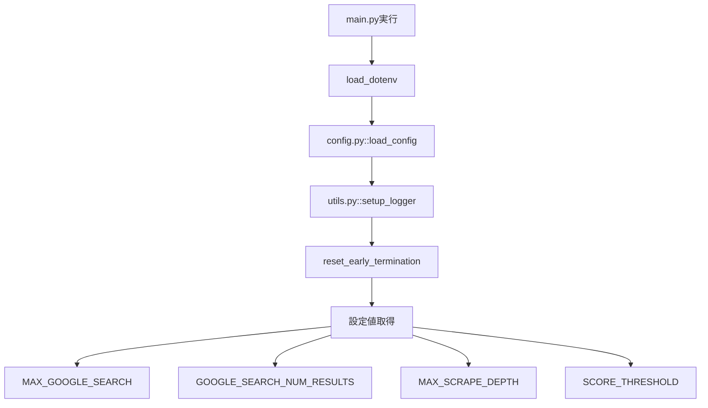

### 2. API制限管理フロー
- API制限管理フロー: Google Search API の使用量管理と制限チェック

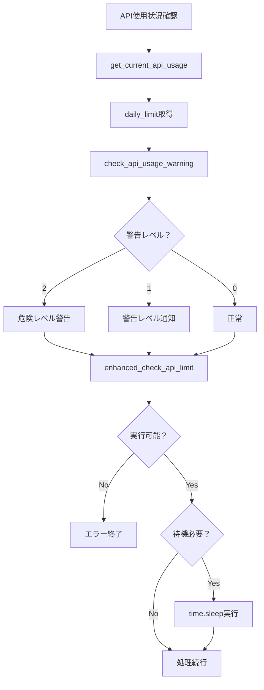

### 3. AI検索クエリ生成フロー
- AI検索クエリ生成フロー: Ollamaを使った検索クエリ自動生成

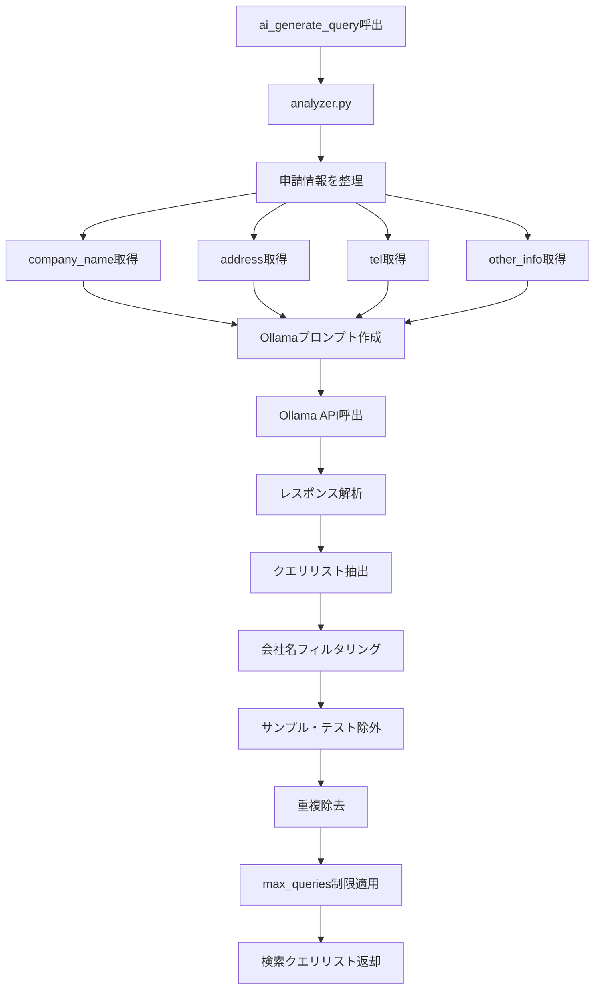

### 4. Google検索フロー
- Google検索フロー: Custom Search API呼び出しと結果取得

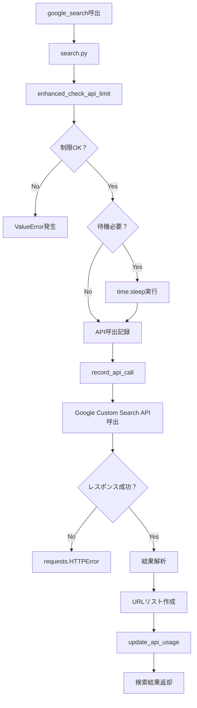

### 5. スクレイピングフロー
- スクレイピングフロー: robots.txt遵守を含むページ取得処理

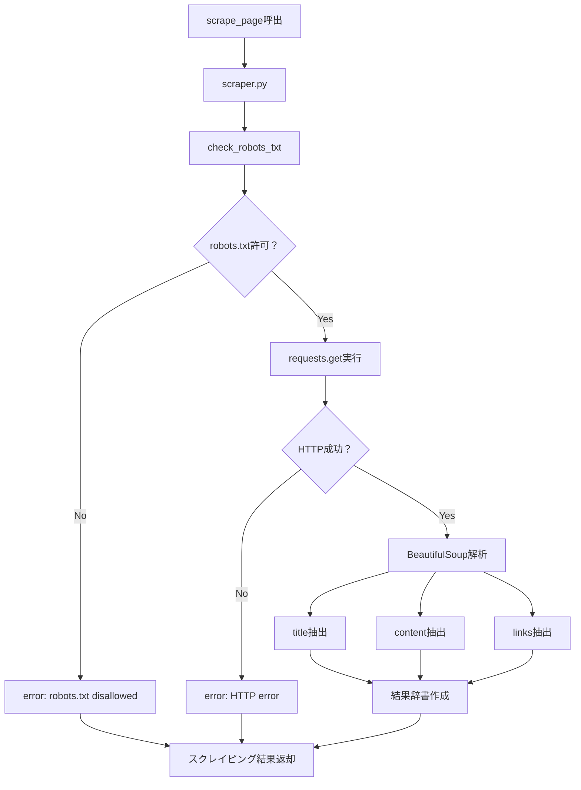

### 6. 再帰スクレイピングフロー
- 再帰スクレイピングフロー: 関連ページの再帰的取得

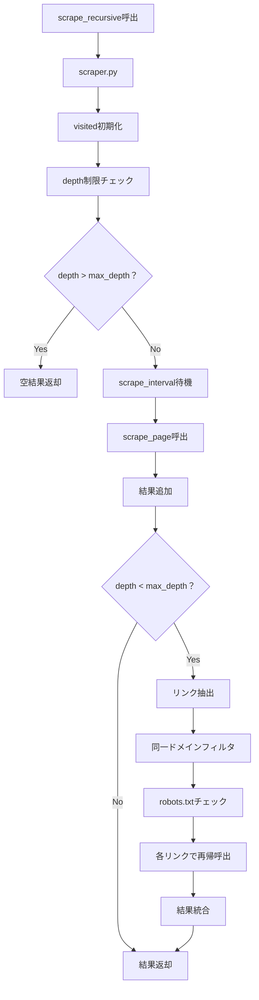

### 7. AI解析フロー
- AI解析フロー: 申請情報との照合とスコア算出

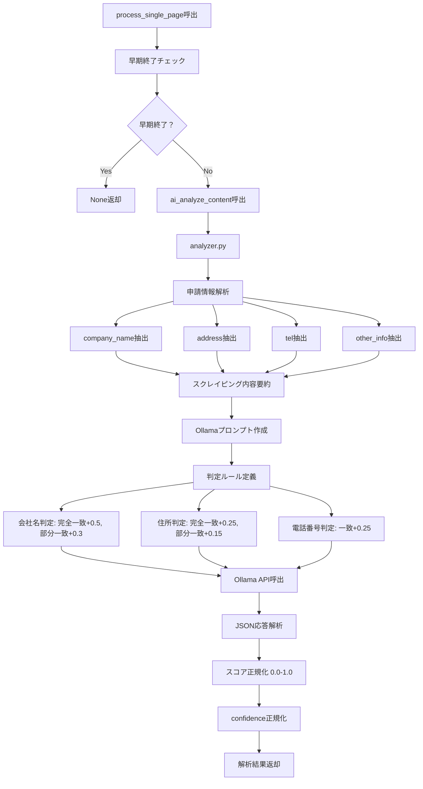

### 8. robots.txt遵守フロー
- robots.txt遵守フロー: スクレイピング前の許可確認

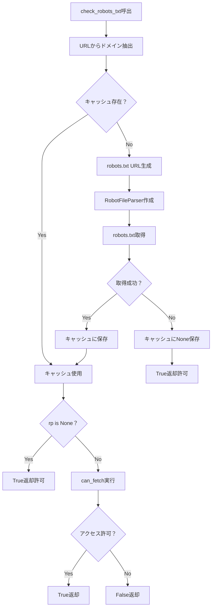

### 9. 早期終了制御フロー
- 早期終了制御フロー: 高スコア検出時の処理制御

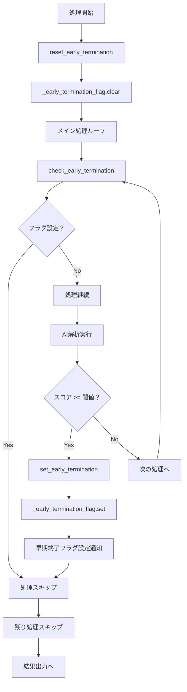

### 10. 結果出力フロー
- 結果出力フロー: 最終的な判定結果の出力

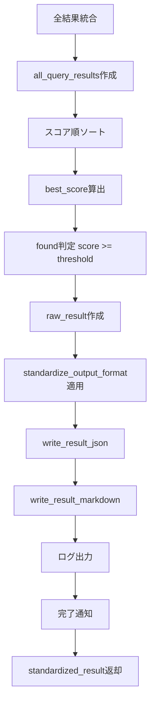

## モジュール間関係図
- モジュール間関係図: 各Pythonファイル間の依存関係

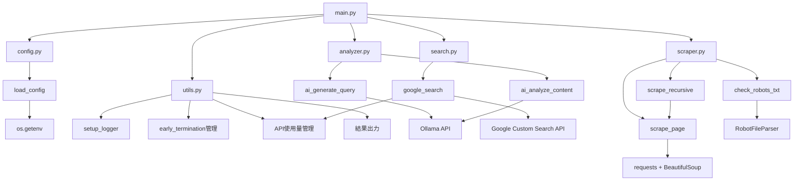

## データフロー図
- データフロー図: 申請情報から最終出力までのデータの流れ

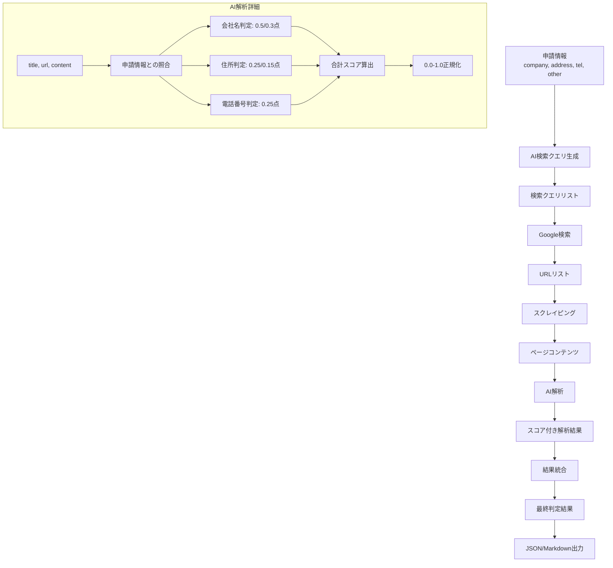

## エラーハンドリングフロー
- エラーハンドリングフロー: 例外処理の仕組み

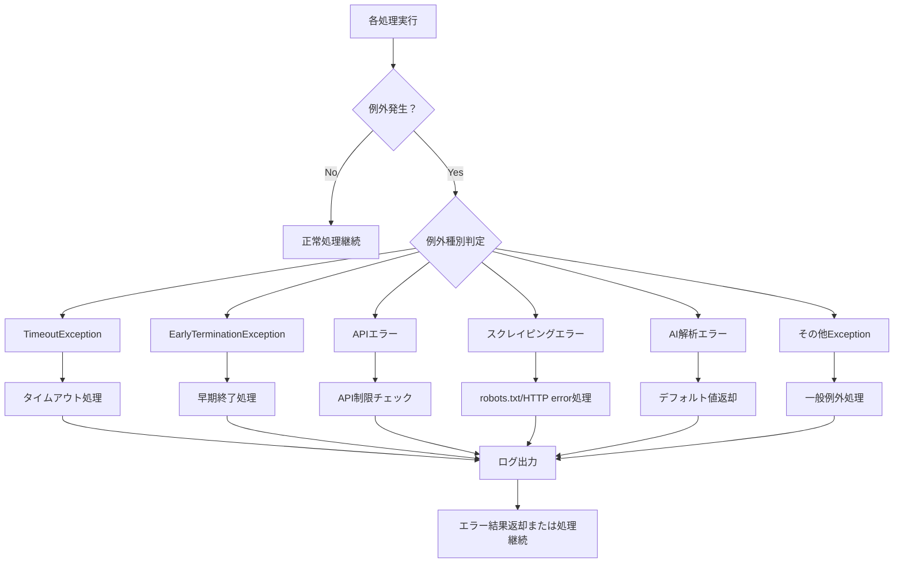

## API制限・レート制限フロー
- API制限・レート制限フロー: Google Search APIの使用量管理

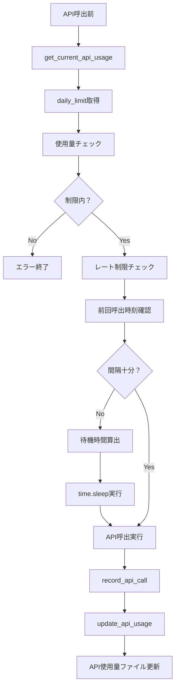

## 設定・環境変数管理
- 設定・環境変数管理: .envファイルからの設定読み込み

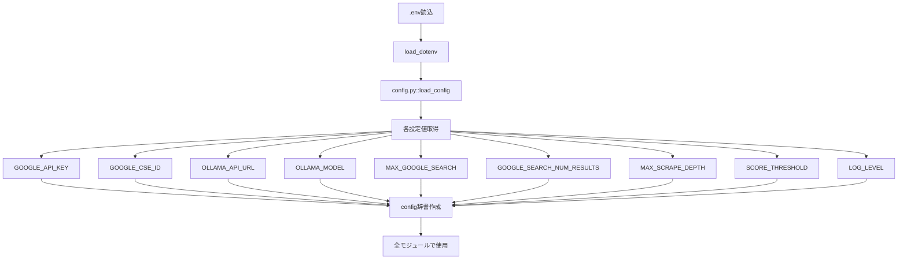

## 重要な制御フロー

### スコア閾値による早期終了
- 各ページ解析後にスコアチェック
- 閾値(0.95)以上で即座に早期終了フラグ設定
- 後続の全処理がスキップされ結果出力へ

### robots.txt遵守
- 全スクレイピング前にrobots.txt確認
- ドメインごとにキャッシュして効率化
- 禁止されたURLは自動的にスキップ

### API使用量管理
- 日次ファイルによる使用量記録
- 制限前の警告通知
- レート制限による自動待機

## 主要な特徴
- 早期終了制御: スコア閾値(0.95)以上で処理を効率的に終了
- robots.txt遵守: 倫理的なスクレイピングの実装
- API使用量管理: 日次制限の監視と自動制御
- 再帰スクレイピング: 関連ページの自動探索
-AI解析: Ollamaを使った申請情報の真正性判定
