# 取引先申請情報確認システム フロー図

## システム概要
申請された取引先情報（会社名・住所・電話番号等）の真正性・実在性をWebサイト解析により自動で確認し、架空請求やペーパーカンパニーのリスクを低減するシステムです。

## メインフロー図

### 📋 読み方ガイド
このフロー図は、システム全体の処理の流れを示しています：

**🏗️ アーキテクチャの特徴**
- **main.py**: システム全体のエントリーポイント。設定読み込みから結果出力まで一貫して制御
- **早期終了制御**: スコア95%以上で高精度マッチを検出した場合、残り処理をスキップして効率化
- **段階的処理**: 初期化 → クエリ生成 → 検索 → スクレイピング → AI解析 → 結果出力の順序で実行
- **条件分岐**: 各段階でエラーチェック、権限確認、閾値判定を行い適切に処理を分岐

**⚡ パフォーマンス最適化のポイント**
- **API制限管理**: Google Search APIの1日100回制限を監視し、超過前に警告
- **robots.txt遵守**: 各サイトのクローリング許可を事前チェック
- **並列処理**: 複数URLの同時スクレイピング（設定可能）
- **キャッシュ機能**: 同一URLの重複アクセス防止

**🎯 主要な判定基準**
- **スコア閾値**: 95%以上で「高い信頼性」判定
- **API使用量**: 80%で警告、90%で制限モード
- **スクレイピング深度**: 最大3階層まで関連ページを探索
- **タイムアウト**: 各ページ10秒、全体処理30分でタイムアウト

```mermaid
graph TD
    %% システム開始・初期化フェーズ
    A[main.py 開始] --> A1[環境変数クリア]
    A1 --> A2[load_dotenv & config読込]
    A2 --> A3[setup_logger設定]
    A3 --> A4[早期終了フラグリセット]
    A4 --> A5[設定値取得<br/>max_queries, num_results,<br/>max_scrape_depth, score_threshold]
    
    %% API制限チェックフェーズ
    A5 --> B[API使用状況確認]
    B --> B1{API制限チェック}
    B1 -->|制限超過| B2[エラー終了]
    B1 -->|OK| C[企業情報取得]
    
    %% 申請情報取得・整理フェーズ
    C --> C1{テストモード？}
    C1 -->|Yes| C2[TestCompanyInfo使用]
    C1 -->|No| C3[コマンドライン引数解析]
    C2 --> D[申請情報リスト作成]
    C3 --> D
    
    %% AI検索クエリ生成フェーズ
    D --> E[AI検索クエリ生成]
    E --> F[各クエリループ開始]
    
    %% メインループ: 各検索クエリの処理
    F --> F1{早期終了フラグ？}
    F1 -->|Yes| Y[結果統合・出力]
    F1 -->|No| G[Google検索実行]
    
    %% Google検索結果の処理
    G --> H[検索結果URLリスト取得]
    H --> I[各URLループ開始]
    
    %% 各URLのスクレイピング・解析ループ
    I --> I1{早期終了フラグ？}
    I1 -->|Yes| X[クエリループ終了]
    I1 -->|No| J[メインページスクレイピング]
    
    %% robots.txt遵守チェック
    J --> J1{robots.txt許可？}
    J1 -->|No| J2[スキップ・次URL]
    J1 -->|Yes| K[ページコンテンツ取得]
    
    %% スクレイピング成功チェック
    K --> K1{スクレイピング成功？}
    K1 -->|No| J2
    K1 -->|Yes| L[AI解析実行]
    
    %% AI解析・スコア判定（重要な分岐点）
    L --> M[スコア算出]
    M --> M1{スコア >= 閾値？}
    M1 -->|Yes| M2[早期終了フラグ設定]
    M2 --> M3[高スコア検出通知]
    M3 --> Y
    
    %% 関連ページスクレイピングフェーズ
    M1 -->|No| N{早期終了フラグ？}
    N -->|Yes| X
    N -->|No| O[関連ページスクレイピング]
    
    O --> P[再帰スクレイピング実行]
    P --> Q[関連ページループ]
    
    %% 関連ページの解析ループ
    Q --> Q1{早期終了フラグ？}
    Q1 -->|Yes| X
    Q1 -->|No| Q2{robots.txt許可？}
    Q2 -->|No| Q3[スキップ・次ページ]
    Q2 -->|Yes| R[関連ページAI解析]
    
    %% 関連ページでの高スコア検出
    R --> S[関連ページスコア算出]
    S --> S1{スコア >= 閾値？}
    S1 -->|Yes| S2[早期終了フラグ設定]
    S2 --> S3[高スコア検出通知]
    S3 --> Y
    S1 -->|No| Q3
    
    %% ループ制御・統計処理
    Q3 --> Q4{関連ページ終了？}
    Q4 -->|No| Q
    Q4 -->|Yes| T[現URLの解析結果統計表示]
    
    T --> U{URLループ終了？}
    U -->|No| I
    U -->|Yes| V[クエリ結果表示・蓄積]
    
    %% クエリループの終了判定
    V --> X
    X --> W{クエリループ終了？}
    W -->|No| F
    W -->|Yes| Y
    
    %% 最終結果処理・出力フェーズ
    Y --> Z[全結果統合・スコア順ソート]
    Z --> Z1[マッチング判定]
    Z1 --> Z2[standardize_output_format適用]
    Z2 --> Z3[JSON/Markdown出力]
    Z3 --> Z4[ログ出力・完了通知]
    Z4 --> END[処理終了]
    
    %% エラー時の分岐
    J2 --> U
    
```

## 詳細処理フロー図
以下は各機能の詳細な処理手順を表したフロー図です。システムの各コンポーネントがどのように連携して動作するかを理解できます。

### 1. 初期化・設定フロー
**目的**: システム起動時の環境設定とロガー設定
**重要ポイント**: 設定値の読み込み順序と早期終了フラグの初期化

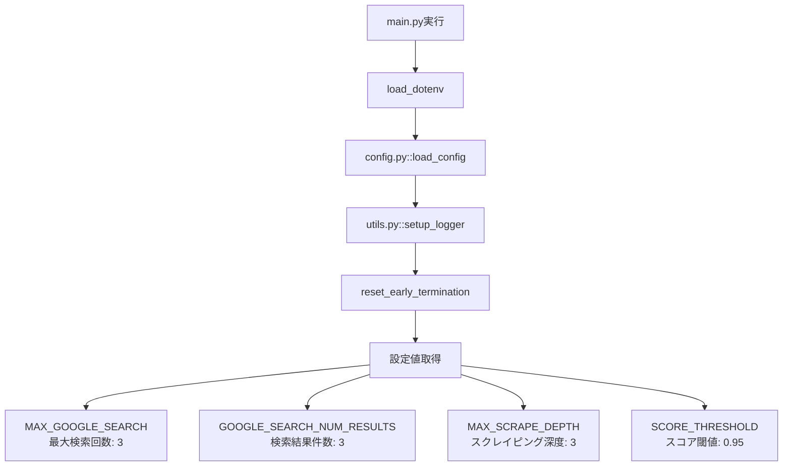

### 2. API制限管理フロー
**目的**: Google Search APIの使用量監視と制限チェック
**重要ポイント**: 日次上限100件の管理とレート制限による自動待機機能

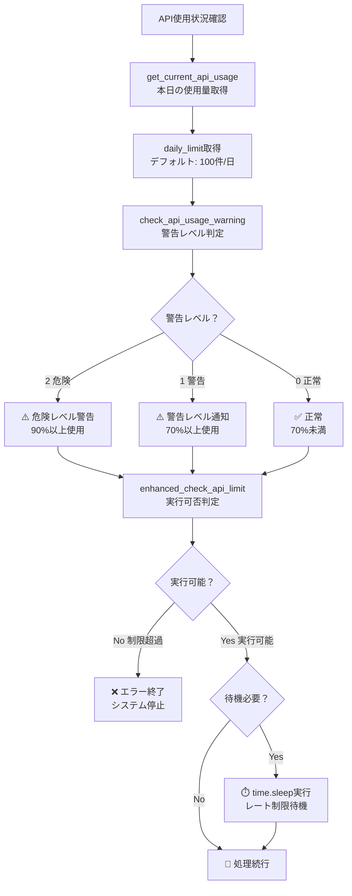

### 3. AI検索クエリ生成フロー
**目的**: 申請情報を基にOllamaが効果的な検索クエリを自動生成
**重要ポイント**: サンプル・テスト用語の除外と会社名フィルタリング

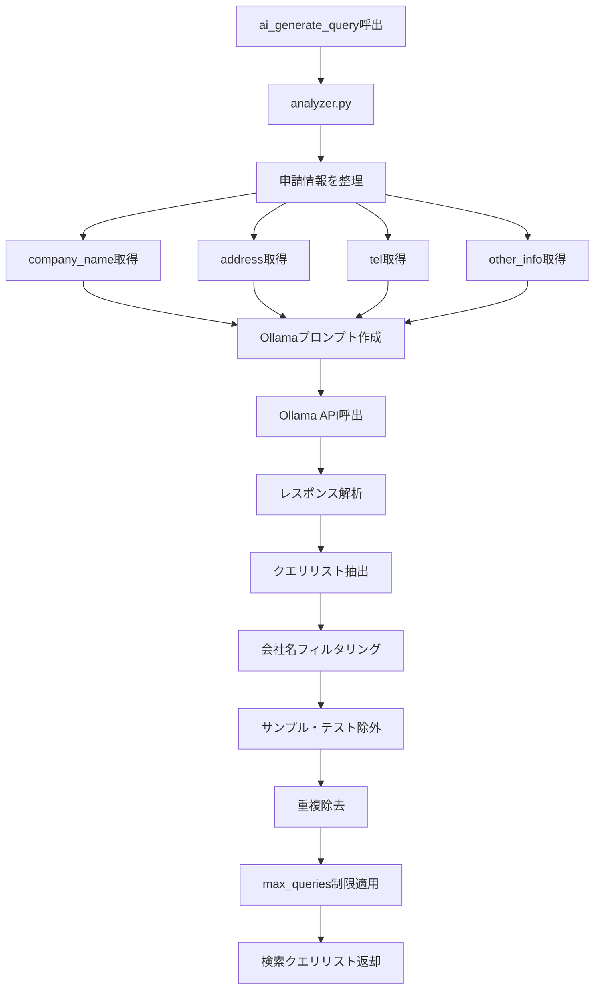

### 4. Google検索フロー
- Google検索フロー: Custom Search API呼び出しと結果取得

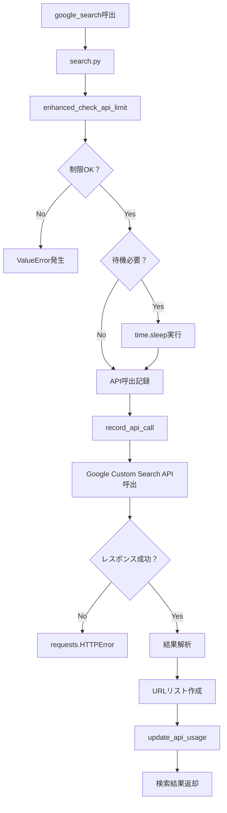

### 5. スクレイピングフロー
- スクレイピングフロー: robots.txt遵守を含むページ取得処理

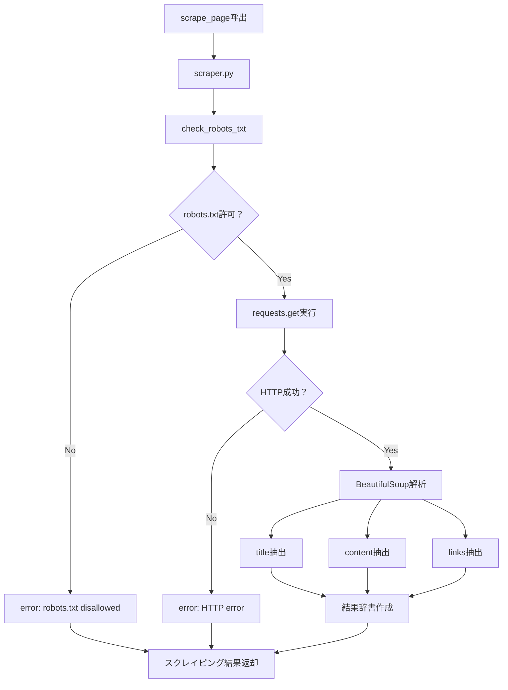

### 6. 再帰スクレイピングフロー
- 再帰スクレイピングフロー: 関連ページの再帰的取得

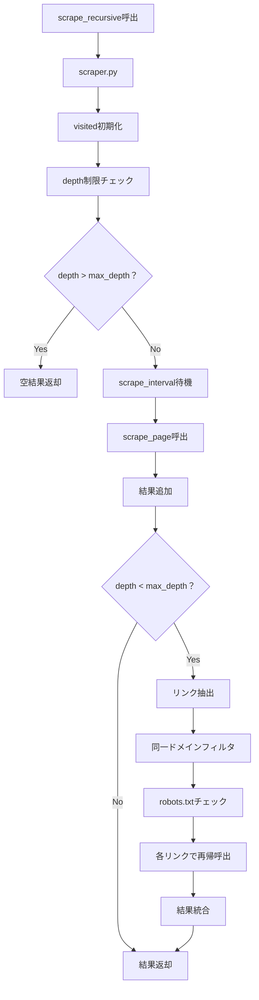

### 7. AI解析フロー
- AI解析フロー: 申請情報との照合とスコア算出

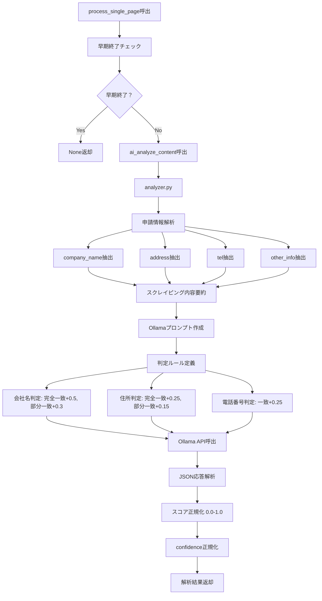

### 8. robots.txt遵守フロー
- robots.txt遵守フロー: スクレイピング前の許可確認

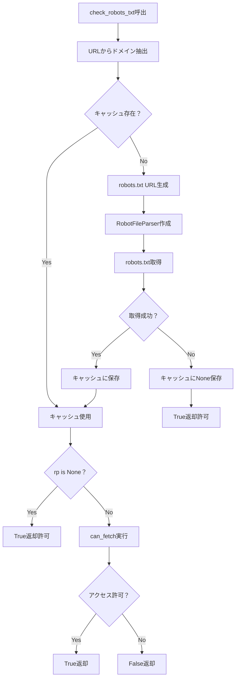

### 9. 早期終了制御フロー
- 早期終了制御フロー: 高スコア検出時の処理制御

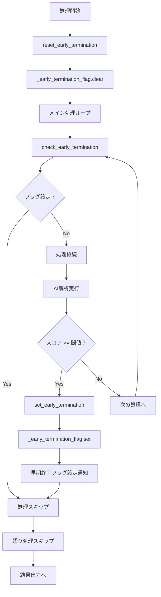

### 10. 結果出力フロー
- 結果出力フロー: 最終的な判定結果の出力

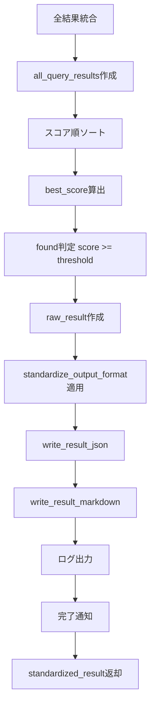

## モジュール間関係図
- モジュール間関係図: 各Pythonファイル間の依存関係

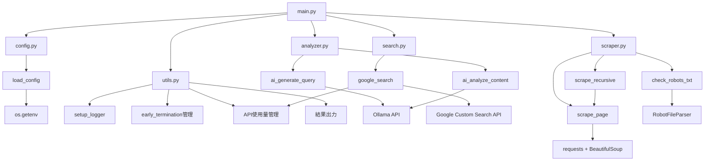

## データフロー図
- データフロー図: 申請情報から最終出力までのデータの流れ

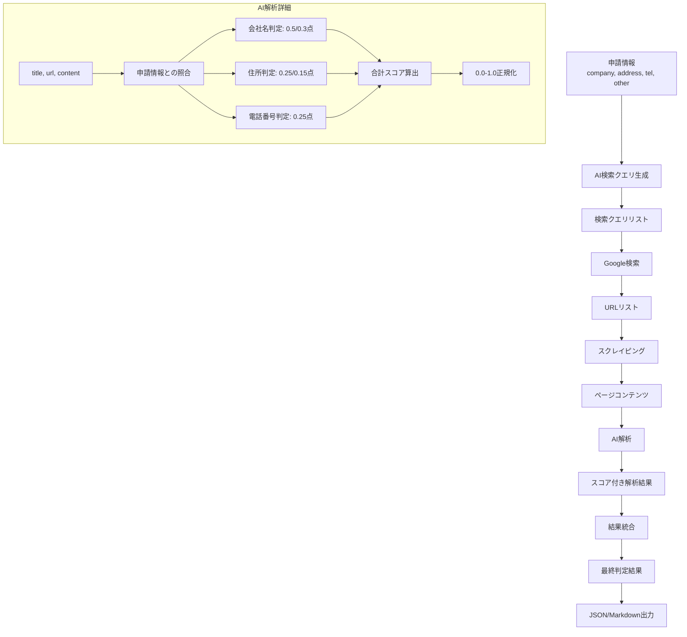

## エラーハンドリングフロー
- エラーハンドリングフロー: 例外処理の仕組み

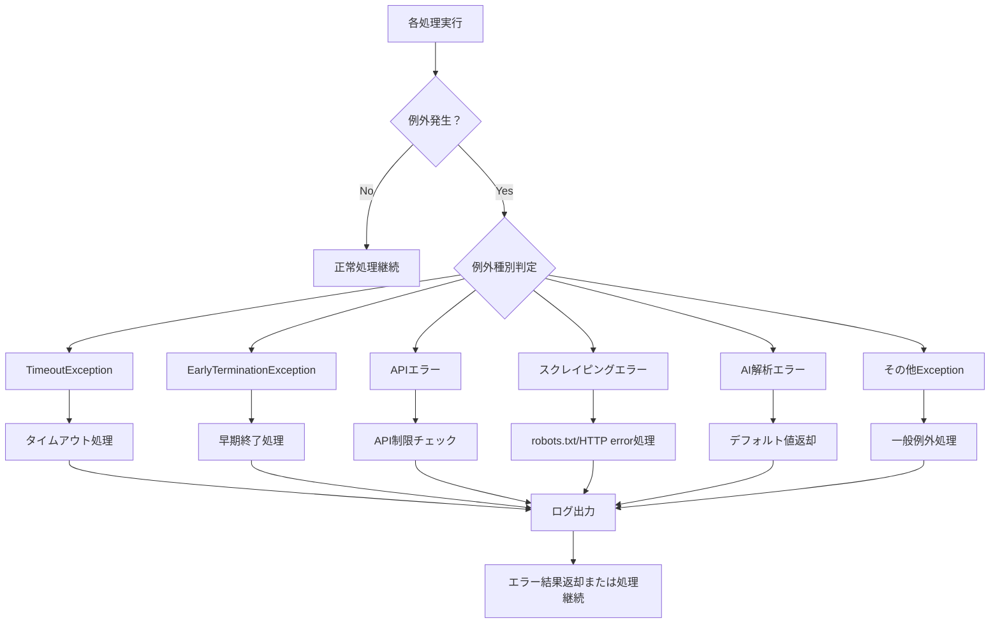

## API制限・レート制限フロー
- API制限・レート制限フロー: Google Search APIの使用量管理

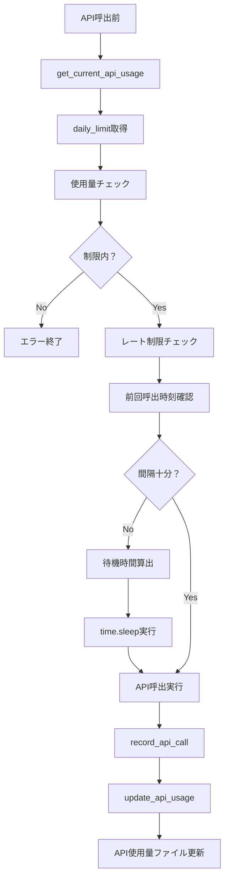

## 設定・環境変数管理
- 設定・環境変数管理: .envファイルからの設定読み込み

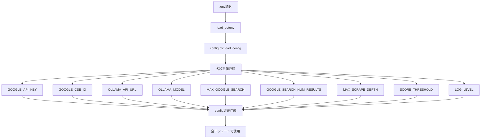

## 重要な制御フロー

### スコア閾値による早期終了
- 各ページ解析後にスコアチェック
- 閾値(0.95)以上で即座に早期終了フラグ設定
- 後続の全処理がスキップされ結果出力へ

### robots.txt遵守
- 全スクレイピング前にrobots.txt確認
- ドメインごとにキャッシュして効率化
- 禁止されたURLは自動的にスキップ

### API使用量管理
- 日次ファイルによる使用量記録
- 制限前の警告通知
- レート制限による自動待機

## 主要な特徴
- 早期終了制御: スコア閾値(0.95)以上で処理を効率的に終了
- robots.txt遵守: 倫理的なスクレイピングの実装
- API使用量管理: 日次制限の監視と自動制御
- 再帰スクレイピング: 関連ページの自動探索
-AI解析: Ollamaを使った申請情報の真正性判定

## 📚 各処理ステップの詳細解説

### 1. システム初期化フェーズ
**目的**: システムの実行環境を整備し、設定値を読み込む

**詳細処理**:
- **環境変数クリア**: 前回の実行結果をクリアして新規実行を保証
- **設定読み込み**: `.env`ファイルとconfigモジュールから運用パラメータを取得
- **ロガー設定**: 実行ログの出力先とレベルを設定（DEBUG/INFO/WARNING/ERROR）
- **フラグ初期化**: 早期終了制御用のグローバルフラグをリセット

**重要な設定値**:
- `GOOGLE_API_KEY`: Google Custom Search APIのAPIキー
- `GOOGLE_CSE_ID`: カスタム検索エンジンID
- `OLLAMA_URL`: OllamaサーバーのエンドポイントURL
- `MAX_QUERIES`: 生成する検索クエリの最大数（デフォルト: 5）
- `NUM_RESULTS`: 各検索で取得する結果数（デフォルト: 5）

### 2. API使用状況確認フェーズ
**目的**: Google Search APIの1日100回制限を管理し、超過を防ぐ

**詳細処理**:
- **現在の使用量取得**: 本日のAPI呼び出し回数をカウントファイルから読み取り
- **警告レベル判定**: 使用量80%で警告、90%で制限モード発動
- **実行可否判定**: 残り処理に必要なAPI呼び出し数を予測し、実行継続の可否を決定

**制限管理のロジック**:
```
- 0-79回: 通常モード（全機能利用可能）
- 80-89回: 警告モード（ログに注意喚起、処理は継続）
- 90-99回: 制限モード（検索クエリ数を削減、慎重に実行）
- 100回到達: 停止モード（翌日まで待機）
```

### 3. 申請情報取得・整理フェーズ
**目的**: 確認対象の企業情報を取得し、後続処理用に標準化する

**処理分岐**:
- **テストモード**: `TestCompanyInfo`クラスの固定データを使用（開発・デバッグ用）
- **本番モード**: コマンドライン引数から企業情報を取得

**データ標準化**:
企業情報を以下の形式に統一:
```python
application_info = {
    "company": "会社名",
    "address": "所在地",
    "tel": "電話番号",
    "other": "その他の情報"
}
```

### 4. AI検索クエリ生成フェーズ
**目的**: 申請情報から効果的な検索クエリを自動生成し、多角的な調査を実現

**AI処理の流れ**:
1. **プロンプト作成**: 申請情報をOllamaに送信用の形式に変換
2. **クエリ生成**: AI（Ollama）が企業の実在性確認に適した検索クエリを複数生成
3. **フィルタリング**: 重複除去、不適切なクエリの排除
4. **優先順位付け**: より効果的と思われるクエリから実行

**生成されるクエリの例**:
- `"株式会社サンプル" site:company.com`
- `"サンプル会社" "東京都渋谷区" 電話番号`
- `"Sample Company" 会社概要 代表者`

### 5. 検索・解析ループフェーズ
**目的**: 各検索クエリでGoogle検索を実行し、関連するWebサイトを特定

**ループ制御**:
- **早期終了チェック**: 各ループ開始時にグローバルフラグを確認
- **API制限確認**: 検索実行前に残りAPI回数をチェック
- **結果取得**: Google Custom Search APIから検索結果のURLリストを取得

**検索結果の品質管理**:
- 重複URLの除去
- 明らかに無関係なサイトのフィルタリング
- 企業の公式サイトを優先的に選出

### 6. スクレイピング・解析ループフェーズ
**目的**: 特定されたWebサイトから企業情報を抽出し、AI解析でスコア化

**段階的処理**:
1. **メインページスクレイピング**: トップページから基本的な企業情報を抽出
2. **robots.txt遵守チェック**: サイトのクローリング許可を確認
3. **コンテンツ解析**: 抽出したテキストをAIで解析し、申請情報との一致度をスコア化
4. **関連ページ探索**: 会社概要、アクセス、お問い合わせページなどを追加調査

**スコア判定基準**:
```
95-100%: 極めて高い信頼性（早期終了トリガー）
80-94%:  高い信頼性
60-79%:  中程度の信頼性
40-59%:  低い信頼性
0-39%:   信頼性なし
```

### 7. 結果統合・出力フェーズ
**目的**: 全ての調査結果を統合し、最終的な判定結果を出力

**出力形式**:
- **JSON形式**: 機械処理用の詳細データ（`result.json`）
- **Markdown形式**: 人間が読みやすい形式の報告書（`result.md`）

**統合ロジック**:
- 最高スコアを最終スコアとして採用
- 各検索クエリの結果を証拠として併記
- 信頼性レベルに応じた推奨アクションを提示

## 🔧 システム設定とカスタマイズ

### 主要な設定パラメータ
```python
# 検索関連
MAX_QUERIES = 5          # 生成する検索クエリの最大数
NUM_RESULTS = 5          # 各検索で取得する結果数
MAX_SCRAPE_DEPTH = 3     # 関連ページの最大探索深度

# AI解析関連
OLLAMA_MODEL = "llama3.1"  # 使用するAIモデル
SCORE_THRESHOLD = 95.0     # 早期終了のスコア閾値

# 制限・タイムアウト
API_DAILY_LIMIT = 100      # Google Search APIの1日制限
REQUEST_TIMEOUT = 10       # 各HTTP要求のタイムアウト(秒)
```

### カスタマイズポイント
1. **検索クエリのパターン**: `analyzer.py`のプロンプトを調整
2. **スコア判定ロジック**: AI解析の評価基準をカスタマイズ
3. **スクレイピング対象**: 特定の業界に特化したページ抽出ルール
4. **出力フォーマット**: 組織のレポート要件に応じた出力形式

## ⚠️ 運用上の注意事項

### セキュリティ
- APIキーは`.env`ファイルで管理し、gitにコミットしない
- スクレイピング先サイトのrobots.txtを必ず遵守
- 過度なアクセスでサーバーに負荷をかけない

### パフォーマンス
- API制限を超えないよう使用量を監視
- 大量処理時は処理間隔を調整
- メモリ使用量を定期的にチェック

### メンテナンス
- 定期的にAPI使用量ログをクリーンアップ
- Ollamaサーバーの動作状況を監視
- 検索結果の品質を定期的に評価・改善
