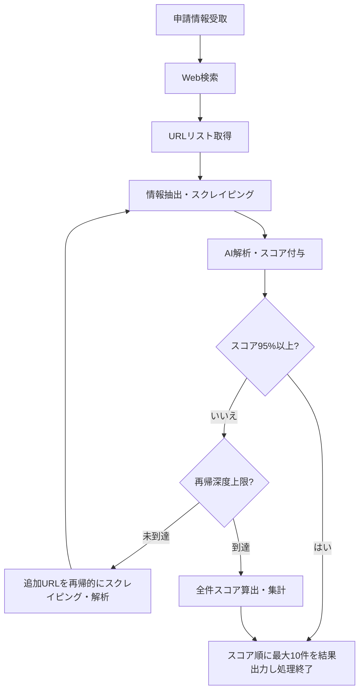

# 取引先登録申請内容確認システム 設計書

## 目次
1. システム概要
2. システム全体構成
3. モジュール構成
4. システム処理フロー図
5. データフロー
6. 主要技術・ライブラリ
7. 設定ファイル・.envサンプル
8. 入出力例
9. データ構造例
10. 制限事項・運用ルール
11. ログ管理
12. Google Search API使用件数管理について
13. robots.txt遵守仕様
14. Testについて

---

## 1. システム概要
申請された取引先情報（会社名・住所・電話番号等）の真正性・実在性をWebサイト解析により自動で確認し、架空請求やペーパーカンパニーのリスクを低減する。

## 2. システム全体構成
- Python (ver12) によるコマンドラインアプリケーション
- .envによる設定管理
- Google Search APIによるWeb検索
- Webスクレイピング（Pythonライブラリ利用）
- AI判定：local ollama (llama3.1:latest)
- 入出力：コマンド引数で申請情報受取、判定結果はjson/Markdownで出力

## 3. モジュール構成
- main.py : エントリーポイント、全体制御
- search.py : Google Search API連携
- scraper.py : Webスクレイピング処理
- analyzer.py : 収集データのAI解析・判定
- config.py : .env設定読込
- utils.py : 共通処理（正規化、ロギング等）

## 4. システム処理フロー図


## 5. データフロー
1. コマンド引数で申請情報を受け取る
2. Google Search APIで関連Webページを検索（最大5回）
3. 検索結果からWebページをスクレイピング（深度最大10、再帰的にURLをたどる）
4. 各取得ページごとにAI（ollama）で解析・スコア付与
5. いずれかのページでスコア95%以上となった場合、その時点でスコア順に最大10件を出力し処理終了
6. 深度上限まで再帰的にスクレイピング・解析を繰り返し、スコア95%以上がなければ全件スコア集計し、スコア順に最大10件を出力
7. 申請情報に基づくURLが見つからなかった場合もその旨を明示して出力
8. 途中経過や進捗はログとして出力

## 6. 主要技術・ライブラリ
- requests, dotenv, beautifulsoup4, ollama API, logging
- urllib.robotparser: robots.txt解析・遵守チェック用
- time: スクレイピング間隔制御用

## 7. 設定ファイル・.envサンプル
```
GOOGLE_API_KEY=xxxxxxx
GOOGLE_CSE_ID=xxxxxxx
OLLAMA_API_URL=http://localhost:11434/api/chat
OLLAMA_MODEL=llama3.1:latest
MAX_GOOGLE_SEARCH=3
GOOGLE_SEARCH_NUM_RESULTS=3  # 1回のGoogle検索で取得する最大件数
MAX_SCRAPE_DEPTH=3
SCORE_THRESHOLD=0.95
LOG_LEVEL=INFO
```

## 8. 入出力例
- 入力（コマンドライン例）:
  ```
  python main.py --company "株式会社サンプル" --address "東京都千代田区1-1-1" --tel "03-1234-5678"　--other "旧会社名はエグザンプル" "fax:03-1234-5679"
  ```
- 入力（Pythonリスト例）:
  ```python
  application_info = [
      "株式会社サンプル",
      "東京都千代田区1-1-1",
      "03-1234-5678",
      "東京支店",
      "旧サンプル株式会社"
  ]
  ```
- 検索クエリ生成：
  - 申請情報（リストやdict）をもとにAI（ollama等）が最適なGoogle検索クエリを自動生成する
  - 例: `search_query = ai_generate_query(application_info)`
- 出力（result.json例：スコア95%以上で即時出力された場合）:
  ```json
  {
    "company": "株式会社サンプル",
    "address": "東京都千代田区1-1-1",
    "tel": "03-1234-5678",
    "results": [
      {
        "url": "https://sample.co.jp",
        "score": 0.97,
        "is_real": true,
        "reason": "Web上の複数サイトで一致情報を確認"
      },
      ... 最大10件 ...
    ],
    "searched_url_count": 7,
    "found": true,
    "early_terminated": true
  }
  ```
- 出力（result.json例：全件集計後に出力された場合）:
  ```json
  {
    "company": "株式会社サンプル",
    "address": "東京都千代田区1-1-1",
    "tel": "03-1234-5678",
    "results": [
      {
        "url": "https://sample.co.jp",
        "score": 0.89,
        "is_real": true,
        "reason": "Web上の複数サイトで一致情報を確認"
      },
      ... 最大10件 ...
    ],
    "searched_url_count": 10,
    "found": true,
    "early_terminated": false
  }
  ```
- 出力（result.json例：URLが見つからなかった場合）:
  ```json
  {
    "company": "株式会社サンプル",
    "address": "東京都千代田区1-1-1",
    "tel": "03-1234-5678",
    "results": [],
    "searched_url_count": 0,
    "found": false,
    "early_terminated": false,
    "message": "申請情報に基づくURLが見つかりませんでした"
  }
  ```
- 出力（result.md例）:
  ```markdown
  # 判定結果
  - 会社名: 株式会社サンプル
  - 住所: 東京都千代田区1-1-1
  - 電話番号: 03-1234-5678
  - 検索URL数: 10
  - 見つかった: ✅
  
  ## 上位10件（スコア順）
  | スコア | URL | 判定理由 |
  |-------|-----|----------|
  | 0.92  | https://sample.co.jp | Web上の複数サイトで一致情報を確認 |
  | ...   | ... | ... |
  ```

## 9. データ構造例
- 申請情報: dict
  ```python
  {
    "company": "株式会社サンプル",
    "address": "東京都千代田区1-1-1",
    "tel": "03-1234-5678",
    "branch": "東京支店",
    "old_name": "旧サンプル株式会社"
  }
  ```
- Web収集データ: list[dict]
  ```python
  [
    {"url": "https://sample.co.jp", "title": "会社概要", "company": "株式会社サンプル", "address": "東京都千代田区1-1-1", "tel": "03-1234-5678"},
    ...
  ]
  ```

## 10. 制限事項・運用ルール
- Google Search APIの利用は1日100件まで（無料枠制限）
- 1回の実行で行うGoogle検索は最大5回まで（ただし、1日100件の上限を超えないように管理すること）
- 1回のGoogle検索で取得する最大件数は.envのGOOGLE_SEARCH_NUM_RESULTSで管理する
- 検索実行ごとに現在のAPI使用件数を読み込み・チェック・保存する処理を実装し、上限超過時はエラー終了または警告を出すこと
- スクレイピングは、取得したリンク先からさらに再帰的にスクレイピングを行う（深度最大10まで）
- 各取得ページごとにAI解析・スコア付与を行い、スコア95%以上となった時点でスコア順に最大10件を出力し処理終了
- 深度上限まで再帰的にスクレイピング・解析を繰り返し、スコア95%以上がなければ全件スコア集計し、スコア順に最大10件を出力
- 申請情報に基づくURLが見つからなかった場合もその旨を明示して出力
- 途中までの解析結果や進捗はログとして出力し、最終的にレポートとしてまとめる
- Markdownレポートは人が見て理解しやすいようにフォーマットを工夫する
- 各種閾値や最大回数などのパラメータは.envで管理する
- **robots.txt遵守**: 全スクレイピング対象サイトのrobots.txtを事前確認し、Disallow指定されたページは除外する
- **アクセス頻度制限**: サーバー負荷軽減のため、スクレイピング間隔を1秒以上設ける
- **User-Agent明示**: スクレイピング実行時は適切なUser-Agent文字列を設定する
- pytestではなくmainなどを使用してテストする

---

## 11. ログ管理
- すべての主要処理（検索、スクレイピング、AI判定、進捗、エラー等）はログとして記録する
- ログレベル（INFO/DEBUG/ERROR等）は.envで設定可能
- ログはファイル（例: app.log）および標準出力に出力
- 途中経過や進捗、エラー、最終判定結果を必ず記録
- utils.pyにsetup_logger()を実装し、全モジュールで共通利用

---

## 12. Google Search API使用件数管理について
- 検索APIを実行するたびに、当日分のAPI使用件数をファイル等で記録・読み込み・更新すること
- 1日100件の上限を超える場合は、検索を中断しエラーまたは警告を出力すること
- 使用件数の記録例：`search_api_count_YYYYMMDD.txt` などの日付付きファイルで管理
- この管理処理はsearch.pyまたはutils.pyで実装する

この設計書に基づき、各モジュールを実装してください。
アジャイル開発で動くものを作ること
実装・テストを繰り返してスモールステップで実装をする

## 13. robots.txt遵守仕様
### 13.1 概要
Webスクレイピング実行前に対象サイトのrobots.txtを確認し、スクレイピング許可・禁止の判定を行う。

### 13.2 実装要件
- スクレイピング対象URLに対して、robots.txtファイルの存在を確認
- robots.txtが存在する場合、User-Agent "*" または独自User-Agentに対するDisallow指定をチェック
- Disallow指定されているパス・ページはスクレイピング対象から除外
- robots.txtが取得できない場合（404等）は、スクレイピング可能と判定

### 13.3 技術実装
- Pythonのrobotparserライブラリまたは同等機能を使用
- robots.txtのキャッシュ機能（同一ドメインの重複チェック回避）
- User-Agent設定：`Mozilla/5.0 (compatible; CompanyVerificationBot/1.0; +http://localhost/robots.txt)`

### 13.4 処理フロー
```
1. スクレイピング対象URL取得
2. URLからドメイン抽出
3. https://domain.com/robots.txt を取得
4. robotparserでDisallow判定
5. 許可される場合のみスクレイピング実行
6. 禁止される場合はログ出力してスキップ
```

### 13.5 エラーハンドリング
- robots.txt取得失敗時は警告ログを出力し、スクレイピング続行
- robots.txt解析エラー時も同様の処理
- 処理時間短縮のため、robots.txtチェックは5秒でタイムアウト

## 14. Testについて
- pytestなどは使用しない
- mainからの呼び出しのシンプルなものでテストを行う